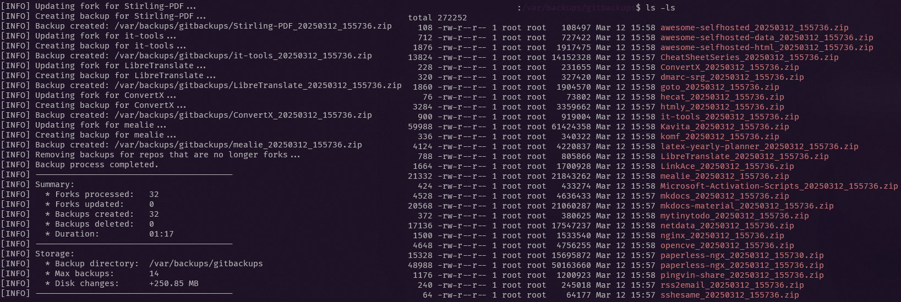

# Fork Sync Backup

> Fork Sync Backup is a Bash script designed manage your forked repositories. The script automatically synchronizes forks with their upstream repositories, creates timestamped zip backups, prunes older backups, and updates each fork's description with the last sync time.

 

## ✨ Features

- **Automatic Fork Synchronization:**  
  Detects the default branch for each fork and updates it by merging upstream changes.

- **Optional Change Detection:**  
  Control whether the script only backs up when new changes exist (or no backup exists) or always backs up.

- **Backup Retention:**  
  Automatically removes older backups, retaining only a specified number of the most recent backups.

- **Repository Description Update:**  
  Updates each fork's description with the last sync time.

## 📷 Screenshots



## ⚙️ Requirements

- **Bash:** Compatible with Unix-like systems
- **grep:** A command-line utility for searching plain-text data
- **jq:** A lightweight command-line JSON processor
  Install via your package manager (e.g., `sudo apt install jq` or `brew install jq`)
- **curl:** For interacting with the GitHub API
  Install via your package manager (e.g., `sudo apt install curl` or `brew install curl`)
- **GitHub Personal Access Token:**  
  Ensure the token has sufficient permissions to read and update your repositories

## 🛠️ Installation

1. **Clone the Repository or download the `backup_forks.sh` script:**

    ```bash
    git clone https://github.com/your-org/fork-sync-backup.git
    cd fork-sync-backup
    ```

2. **Install Dependencies:**  
   Make sure `jq` and `curl` are installed on your system.

3. **Make the Script Executable:**

    ```bash
    chmod +x backup_forks.sh
    ```

## 🔑 Configuration

Open `backup_forks.sh` in your favorite text editor and configure the following variables at the top:

```bash
GITHUB_ORG="your_org_here"          # Your GitHub organization name (e.g., "Forks-by-Rabenherz")
GITHUB_TOKEN="your_token_here"      # GitHub Personal Access Token with necessary permissions (Fine-grained permissions: "administration, code, commit statuses"
BACKUP_DIR="/path/to/backup_dir"    # Local directory to store backup zip files (e.g., "./backups" or "/tmp/backups")
MAX_BACKUPS=30                      # Maximum number of backups to retain per repository (older backups will be deleted)
CHECK_FOR_CHANGES=true              # Set to "true" to check for changes before taking a backup, "false" to always take a backup
REMOVE_UNFORKED_BACKUPS=false       # Set to "true" to remove backups for repositories that are no longer forked, "false" to keep them
VERBOSE=false                       # Set to "true" for detailed output, "false" for minimal output (this is used for debugging)
```

## 🚀 Usage

Run the script to synchronize your forks, create backups, and update descriptions:

```bash
./backup_forks.sh
```

I recommend setting up a cron job to run the script automatically at regular intervals. For example, to run the script every day at 3 AM:

```bash
0 3 * * * /path/to/backup_forks.sh
```
